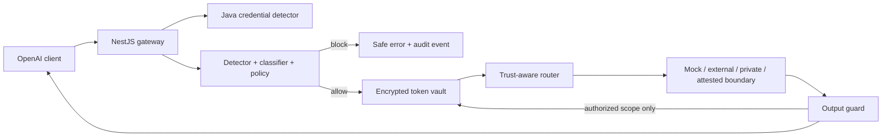

# AttestGuard

> Attestation-Gated Privacy Gateway for Enterprise AI

AttestGuard is a security gateway for OpenAI-compatible AI traffic. Its processing model is:

**Detect → Classify → Tokenize or Block → Route → Attest → Rehydrate**

In 30 seconds: point an existing OpenAI client at AttestGuard. The gateway scans locally, blocks credentials, pseudonymizes eligible identifiers, chooses the minimum permitted provider trust, validates output tokens, and rehydrates only for the authenticated request scope.

Reversible transformations are **pseudonymization**, **reversible tokenization**, or **de-identification**—never complete anonymization. A mock, VM, or ordinary Docker container is not confidential computing.

## Why it is different

- A Java 17 high-priority credential detector runs before provider invocation and fails closed when required but unavailable.
- NestJS combines structured/context detection, document classification, YAML policy, trust-aware routing, token scope, output validation, and audit metadata in one transactional path.
- AES-256-GCM protects mappings; HMAC authenticates opaque 128-bit surrogate tokens.
- Unknown/model-generated tokens are rejected before vault lookup, preventing a lookup oracle.
- Tenant, user, application, session, purpose, policy version, provenance, TTL, and use count constrain rehydration.
- Simulation is always `SIMULATED — NOT HARDWARE-BACKED` and cannot satisfy `ATTESTED_TEE`.

## Architecture



Detailed diagrams: [architecture](docs/ARCHITECTURE.md), [data flows](docs/DATA_FLOW.md), and [trust boundaries](docs/TRUST_BOUNDARIES.md).

## Implemented versus planned

| Implemented and tested | Planned / not verified |
|---|---|
| NestJS compatible chat/responses, scan, tokenize, policy, provider, event, audit, attestation, and internal APIs | Durable PostgreSQL/pgvector repositories and migrations |
| Java credential scanner on the real gateway boundary | Presidio/NER/organization-dictionary production adapters |
| Local recognizers, classification, overlap resolution, and Unicode offset mapping | Full RAG ingestion/retrieval and empirical detection benchmark |
| YAML deny-override policy and provider downgrade protection | Production OIDC, mTLS, rate limiting, and workload identity |
| AES-GCM token vault, HMAC parser, TTL, replay and scope enforcement | AWS/Azure/GCP KMS implementations |
| Mock LLM routes and explicit simulated attestation failure | NVIDIA NIM, RAS evidence verification, NeMo Guardrails, and Morpheus |
| Hash-chained metadata-only in-memory audit events | Durable SIEM export and checkpoints |
| Next.js Prompt inspector console | Policy editor, event analytics, and production admin workflows |

## Run locally

Requirements: Node.js 22+, Java 17+, and optionally Docker.

```sh
cp .env.example .env
# Replace JWT_SECRET in .env with 32+ random development characters.
npm ci
make java-run            # terminal 1
make dev-api             # terminal 2, with variables from .env exported
make dev-web             # terminal 3
make demo-token          # paste the 15-minute token into the console
```

Or run the demo containers:

```sh
docker compose up --build
```

The console is at `http://localhost:3000`; the API is at `http://localhost:8080`. Use synthetic data only. See [deployment notes](docs/DEPLOYMENT.md).

## Example behavior

- Korean name and phone → `TOKENIZE_AND_ALLOW` → `mock-enterprise`; the provider sees surrogate tokens, and the same scoped requester receives the authorized response.
- Synthetic private-key marker → `BLOCK_AND_ALERT`; the provider call count remains unchanged and the event contains no raw secret.
- Confidential source-code pattern → public request is upgraded to `mock-private`; this is routing simulation, not proof of a protected VPC.
- Restricted content → blocked because no enabled `ATTESTED_TEE` provider exists.

## Verification

```sh
make format
make lint
make typecheck
make test
make build
npm audit --audit-level=high
```

The dated [evaluation report](docs/EVALUATION.md) records 16 gateway security tests, Java assertions, UI security-copy verification, strict type/lint checks, and builds. Precision/recall/F1 and performance targets are not yet measured and are not presented as achieved.

## Security model and limitations

Read the [threat model](docs/THREAT_MODEL.md), [cryptography](docs/CRYPTOGRAPHY.md), [attestation boundary](docs/ATTESTATION.md), [security limitations](docs/SECURITY_LIMITATIONS.md), and [security policy](SECURITY.md).

Tokenizing some identifiers does not remove a document's trade-secret value. Proprietary code, legal documents, forecasts, and other content-level secrets require a private or genuinely attested route according to policy. AttestGuard makes no claim about an external provider's execution environment without independently verifiable evidence.

## NVIDIA integration points

The design reserves adapters for NVIDIA NIM, NVIDIA Attestation Suite/RAS, NeMo Guardrails input/retrieval/output rails, confidential GPU deployment, and Morpheus event analysis. No NVIDIA hardware or service credentials were available, so these are documented boundaries rather than successful integrations. See [the scope truth table](docs/SCOPE.md).

## Next priorities

1. PostgreSQL repositories, migrations, constraints, and cross-tenant integration tests.
2. Synthetic evaluation corpus with reproducible precision/recall and latency reports.
3. SANITIZED_EMBEDDING RAG ingestion, ACL retrieval, and injection quarantine.
4. Production identity/internal mTLS and a real cloud KMS adapter.
5. NVIDIA NIM/RAS validation on supported confidential hardware.
