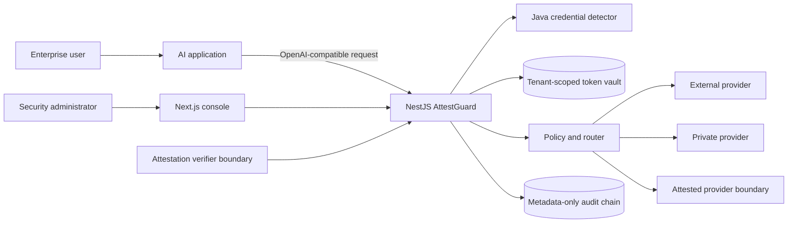

# Architecture

## Decision summary

Phase 1 is a small polyglot modular system rather than dozens of services:

- **NestJS gateway:** authentication, orchestration, policy, token vault, routing, output guard, attestation boundary, and audit API.
- **Java 17 credential detector:** a dependency-light, local high-priority detector used before lower-risk recognizers.
- **Next.js console:** demo and metadata-only operational views.
- **Mock LLM:** deterministic development provider; it does not imply provider confidentiality.

PostgreSQL, a production KMS, Redis, and pgvector are integration targets. In-memory repositories and local development keys are Phase 1-only and fail startup in production mode.

## System context

## Module boundaries

| Module | Responsibility | Must not do |
|---|---|---|
| auth | verify JWT and produce immutable principal | accept tenant identity from the body |
| detector | normalize, detect, resolve overlaps | send raw text to a cloud classifier |
| policy | decide action and minimum trust | silently downgrade trust |
| token vault | AEAD storage and scoped retrieval | expose raw mappings to end users |
| routing/providers | choose and invoke provider | log sanitized prompts in production |
| output guard | validate tokens and tool data | query unknown model-generated token IDs |
| attestation | verify evidence and issue short leases | treat simulation as hardware evidence |
| audit | append safe, chained metadata | store prompts, responses, or secrets |

## Request invariant

No provider call occurs until the high-priority credential scan, policy evaluation, required pseudonymization, and routing checks succeed. No rehydration occurs from a token merely because a model emitted syntactically valid text.

## Data model direction

Tenant-scoped records include `tenant_id`: Tenant, User, Application, ProviderTrustProfile, Policy, PolicyVersion, DetectionFinding, ClassificationResult, TokenRecord, AttestationPolicy, AttestationResult, KeyLease, SecurityEvent, AuditChainCheckpoint, Document, DocumentChunk, and DocumentAccessPolicy. Repositories require tenant context in their method signatures; future PostgreSQL Row-Level Security is defense in depth, not a substitute for repository scoping.

## Evolution boundary

TokenVault and AttestationVerifier are interfaces so they can later move behind mutually authenticated internal services. Extraction requires operational evidence, not a desire to look like microservices.
