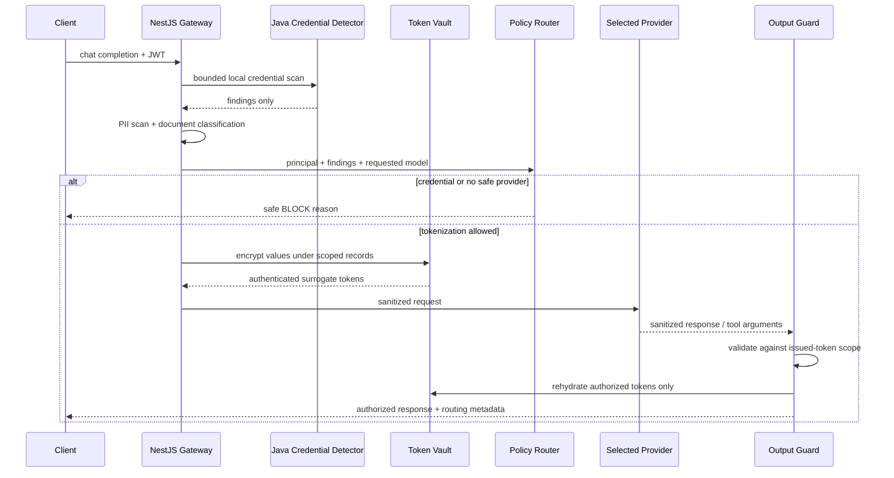
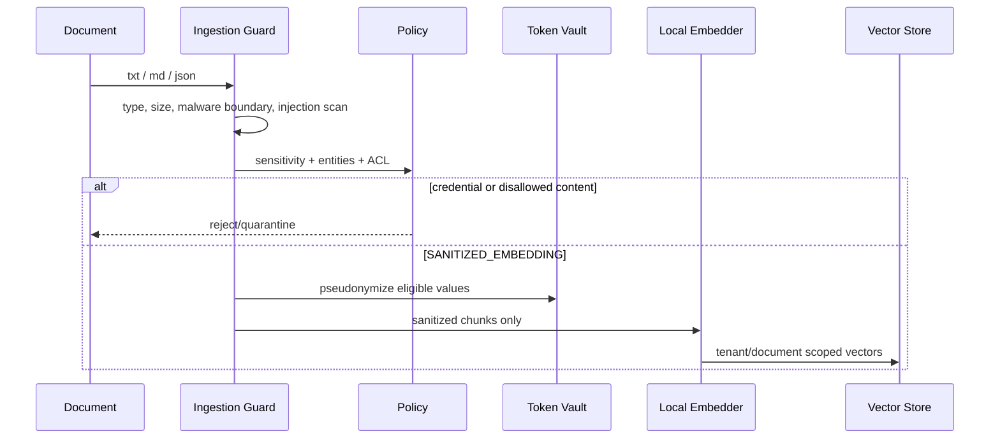
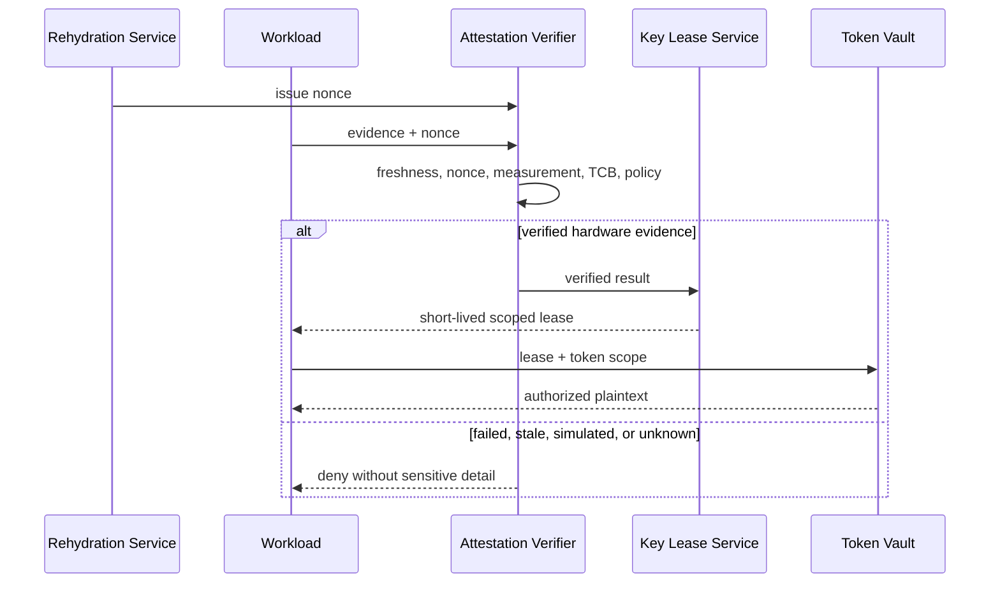

# Data Flows

## Prompt processing

## RAG ingestion

## Attestation and key release

## Streaming output

A bounded incremental parser retains only the maximum possible token-envelope tail between chunks. Complete tokens are released only after strict syntax, provenance, MAC, and authorization checks. A partial, malformed, mutated, or unknown token fails closed; it is never sent to the vault as a lookup oracle.
