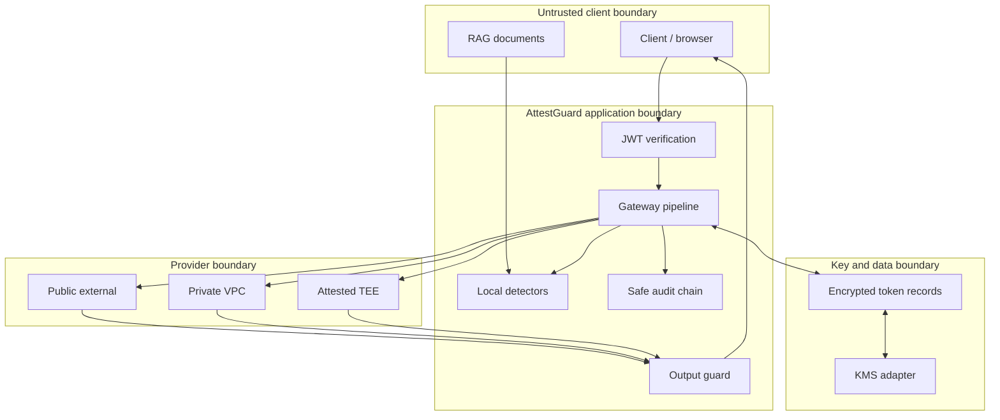

# Trust Boundaries

## Boundary rules

- Client-supplied tenant and user fields are untrusted; verified JWT claims are authoritative.
- Retrieved documents are data, never system instructions.
- The gateway owns provider selection; a requested model is a preference only.
- Public providers receive public data or policy-approved pseudonymized data, never raw credentials.
- Provider trust metadata is administrative configuration, not evidence of actual hardware state.
- Vault records are encrypted with tenant-specific data keys. Production data keys must be wrapped by an external KMS.
- `MockAttestationProvider` reports only `SIMULATED — NOT HARDWARE-BACKED`; it cannot release leases requiring `ATTESTED_TEE`.
- An external LLM is not described as confidential computing when its environment cannot be independently verified.
